# Tutorial de como configurar wireguard

En esta guía vamos a configurar wireguard para que corra en una Maquina Virtual con Alpine Linux.

## Mi Setup

- **Host**: PC con Arch Linux
- **Guest**: Vm con Alpine Linux

## Paso 1) Descargar un Hipervisor.

Para crear máquinas virtuales, necesitamos un Hipervisor, para este proyecto voy a usar VirtualBox.

- [Descargar VirtualBox para Arch](https://wiki.archlinux.org/title/VirtualBox)
- [Descargar VirtualBox para otros Sistemas Linux](https://www.virtualbox.org/wiki/Linux_Downloads)
- [Descargar VirtualBox para Windows](https://www.virtualbox.org/wiki/Downloads)

## Paso 2) Descargar imagen de Alpine Linux

En la [Página oficial de Alpine Linux](https://www.alpinelinux.org/downloads/) encontramos las Imágenes de esta distribución.

Para nuestro caso de uso, usaramos la versión **x86_64** de la sección **"VIRTUAL"**.

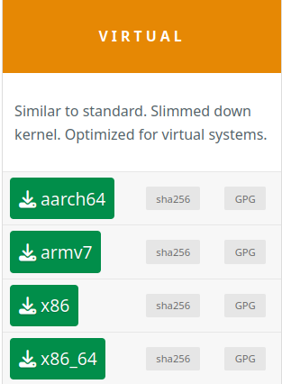


## Paso 3) Crear una Máquina Virtual en el Hipervisor

Creamos la máquina virtual con las siguientes especificaciones

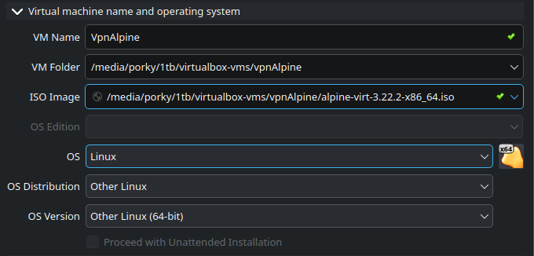

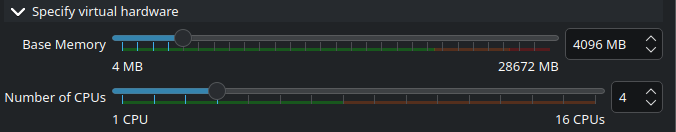

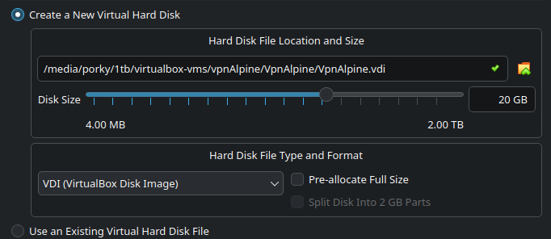

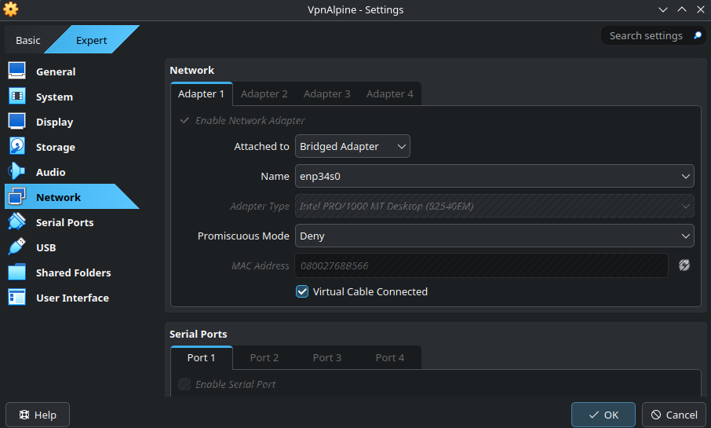

## Paso 4) Configuraciones básica en Alpine.

### Iniciar Sesión
Si no configuramos ninguna credencial de inicio de sesión, se nos darán las siguientes credenciales como default

**user**: root (Sin password)


### Setup-Alpine

Para una configuración guiada de alpine, vamos a ejecutar el comando

```bash
setup-alpine
```

Las configuraciones que yo seleccione fueron:

- KeyboardLayout: latam-deadtile
- Hostname: vpnalpine
- Interface: 
    - dhcp
    - n
- Root Password: ***********
- TimeZone: America/Argentina/Buenos_Aires
- Proxy: none
- Network Time Protocol: busybox
- Apk Mirror: **r** (Use Random Mirror)
- User: porky
    - Which ssh server: openssh
- Disk & Install: 
    - Which disk would you like to use: sda (O el disco que aparezca)
    - How would you like to use it: sys
    - Erease the above disk and continue? (y/n): y

Apagamos la máquina Virtual y desde la interfaz visual seleccionamos la siguiente opción.

Vm -> Configuración -> Almacenamiento -> Controller: IDE -> Remove Attachement. 


Hacemos click derecho y ponemos remove attachement.

Esto hará que la VM no boote desde la iso, sino que use el almacenamiento que le configuramos

### Actualizar Paquetes

Alpine cuenta con su propio package manager llamado [apk](https://wiki.alpinelinux.org/wiki/Alpine_Package_Keeper), en ese link se encuentra una lista de todos los comandos de apk. 
Para actualizar los paquetes debemos ejecutar los siguientes comandos: 

```bash
# Correr con root
su -
apk update
apk upgrade
su - porky
```

### Agregar repositorio community

Agregamos al archivo /etc/apk/repositories

```bash
# Correr con root
su -
vi /etc/apk/repositories
# Agregamos esta línea
#https://dl-cdn.alpinelinux.org/alpine/v3.20/community

apk update
apk upgrade
```

### Instalar Sudo

Para ejecutar comandos sin la necesidad de tener que usar su, vamos a:
- Instalar sudo
- Agregar un usuario al grupo wheel
- Modificar el archivo sudoers para que todos los miembros de wheel puedan ejecutar sudo

```bash
# Correr con root
su
apk add sudo
adduser porky wheel
visudo
## Uncomment to allow members of group wheel to execute any command     
%wheel ALL=(ALL:ALL) ALL
su - porky
```

De ahora en más, no necesitaremos ejecutar los comandos como root, podemos ejecutarlos con sudo.

### Conectar mediante SSH
[Fuente](https://wiki.alpinelinux.org/wiki/Setting_up_a_SSH_server)

Como pueden haber notado, es bastante incómdo ejecutar comandos desde la interfaz Visual de VirtualBox. Por eso, vamos a conectarnos mediante SSH a nuestra máquina virtual de alpine. 

El paquete openssh ya lo instalamos en **setup-alpine**.

Ejecutamos el comando

```bash
ip a
```

Y nuestra ip privada será la que está debajo de la interfaz de red (No la primera, esa es el loopback).

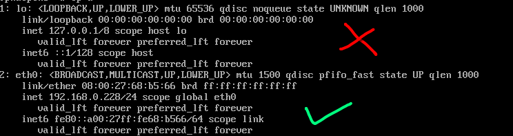

En mi caso, mi ip privada es **192.168.0.228**

Desde nuestro host, ejecutamos el siguiente comando

```bash
ssh porky@192.168.0.228
```
Nos va a pedir la contraseña que configuramos y ya estariamos conectandonos a nuestra VM mediante ssh.

A partir de ahora, recomiendo ejecutar los comandos en el Host mediante ssh, ya que en mi opinión es más comodo. 

## Paso 5) Instalar Docker en Alpine
[Fuente](https://wiki.alpinelinux.org/wiki/Repositories)
[Fuente](https://virtualzone.de/posts/alpine-docker-rootless/)

Vamos a ejecutar wireguard y todos nuestros servicios en docker, para facilitar la configuración y mantenerlos aislados. 

Primero, debemos habilitar los repositorios de la comunidad puesto que el paquete de docker se encuentra allí. 

```bash
# Ejecutar con user porky
su - porky
sudo setup-apkrepos -c
sudo apk add docker docker-cli-compose
sudo rc-update add docker default
sudo service docker start
sudo addgroup ${USER} docker
```

Ejecutar docker rootless: 

Ejecutar docker de esta manera evita que nos expongamos a vulnerabilidades. Si hay una vulnerabilidad en Docker o en algun servicio dentro que ejecutamos con Docker, este no podrá acceder a nuestra computadora como root.

Instalamos los prerequisitos

```bash
# Ejecutar con user porky
sudo apk add shadow-uidmap fuse-overlayfs iproute2 curl
```

Habilitamos cgroups v2  

```bash
# Ejecutar con user porky
su - porky
sudo vi /etc/rc.conf 
# Descomentamos esta línea
rc_cgroup_mode="unified"

sudo rc-update add cgroups && rc-service cgroups start
```

Instalamos docker rootles extas

```bash
# Ejecutar con user porky
su - porky
sudo apk add docker-rootless-extras
```

Habilitamos el modulo iptables

```bash
#Ejecutamos con user root
su
echo "ip_tables" >> /etc/modules
modprobe ip_tables
```

Detenemos docker rootful
```bash
sudo service docker stop
sudo rc-update del docker
```

Instalamos docker rootless:

```bash
#Ejecutamos con user root
su - 
sh -c 'echo "porky:100000:65536" >> /etc/subuid'
sh -c 'echo "porky:100000:65536" >> /etc/subgid'

#Ejecutamos con user porky
su - porky
curl -fsSL https://get.docker.com/rootless | sh

# probamos que funciona docker sin root
docker info # -> Deberia mostrar el estado de docker.
```


Crear Init script en /etc/init.d/docker-rootless

```bash
# Ejecutar con user porky
su - porky
sudo vi /etc/init.d/docker-rootless 

#!/sbin/openrc-run

name=$RC_SVCNAME
description="Docker Application Container Engine (Rootless)"
supervisor="supervise-daemon"
command="/home/porky/bin/dockerd-rootless.sh"
command_args=""
command_user="porky"
supervise_daemon_args=" -e PATH=\"/home/porky/bin:/sbin:/usr/sbin:$PATH\" -e HOME=\"/home/porky\" -e XDG_RUNTIME_DIR=\"/home/porky/.docker/run\""

reload() {
    ebegin "Reloading $RC_SVCNAME"
    /bin/kill -s HUP \$MAINPID
    eend $?
}


```
Hacer el script ejecutable

```bash
# Ejecutar con porky
su - porky
sudo chmod +x /etc/init.d/docker-rootless
sudo rc-update add docker-rootless
sudo rc-service docker-rootless start
```

Crear archivo .profile

```bash
vim .profile

#Añadir
export XDG_RUNTIME_DIR="$HOME/.docker/run"
export DOCKER_HOST=unix://$XDG_RUNTIME_DIR/docker.sock
export PATH="$HOME/bin:/sbin:/usr/sbin:$PATH"
```

## Paso 6) Instalar WireGuard en docker
- [Fuente](https://wg-easy.github.io/wg-easy/latest/examples/tutorials/basic-installation/)
- [Wireguard Github](https://github.com/wg-easy/wg-easy)
- [Wireguard Config Tool](https://www.wireguardconfig.com/)
- [Configurar Wireguard Sin Proxy](https://github.com/wg-easy/wg-easy)

Cargamos los siguientes módulos al Kernel:

```bash
#Ejecutar con user root
su - 
modprobe wireguard
modprobe ip6_tables
modprobe iptable_nat
```

Para hacer que se carguen siempre al bootear la computadora: 

```bash
#Ejecutar con user root
su -
vi /etc/modules
#Agregamos estos modulos al archivo:
wireguard
iptable_nat
ip6_tables
```

Vamos a usar un docker compose para levantar wireguard. 

```bash
#Ejecutar con user porky
su - porky
mkdir -p services/wireguard
sudo mkdir -p /srv/wireguard
cd services/wireguard
sudo curl -o docker-compose.yml https://raw.githubusercontent.com/wg-easy/wg-easy/master/docker-compose.yml

```

Importante: 
Vamos a configurar la web sin proxy. Entonces debemos poner en el environment la siguiente línea:

```bash
environment:
    - INSECURE=true
```

Cambiamos el puerto a 

```bash
ports:
      - "51829:51829/udp"
      - "51821:51821/tcp"
```

```bash
docker compose up -d
````

Con esto, podemos acceder a **http://192.168.0.228:51821** y veremos una interfaz web para usar wireguard.

## Paso 7) Configuración de Wireguard.

Primero, nos creamos un usuario local para luego poder acceder a la WebUI y manejar nuestras VPNs
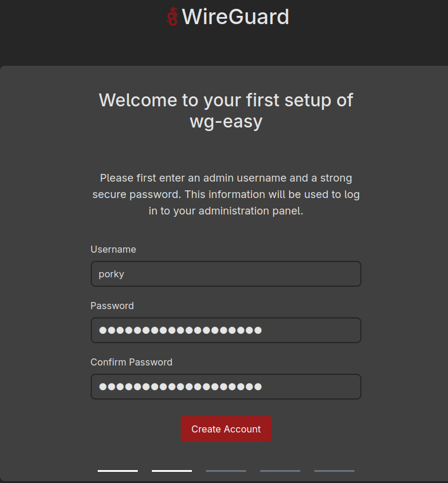

Luego, debemos poner un host y un port al que vamos a conectarnos.
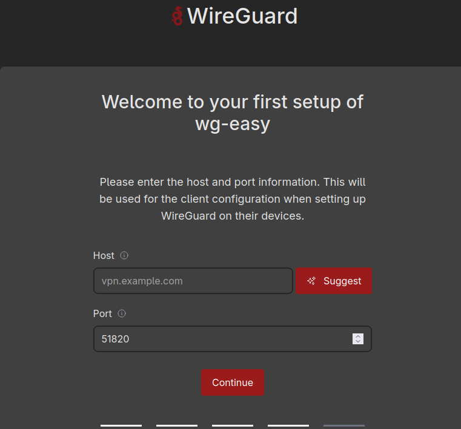

Para tener un dominio, vamos a utilizar **DUCK DNS**

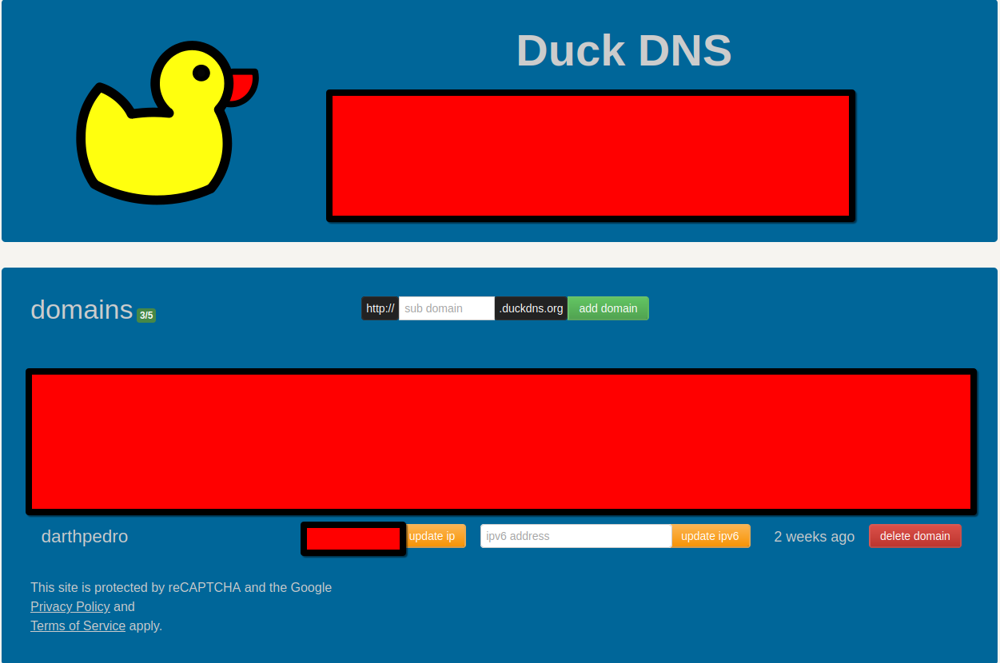

Una vez que terminamos el setup, nos va a aparecer una pantalla para crear clientes de VPN:

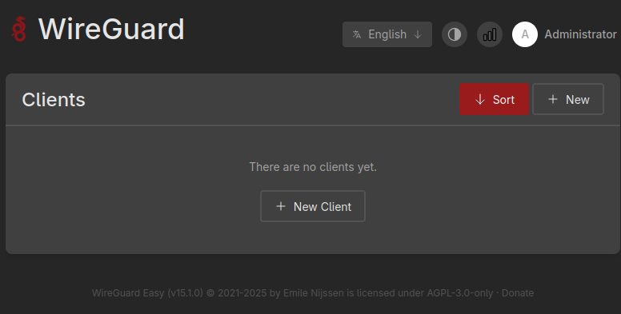

Creamos un nuevo cliente

Importante: Este cliente va a tener todos los puertos internos habilitados de nuestra computadora donde se encuentre wireguard , para restringir puertos tenemos que configurar reglas de firewall.


## Paso 8) Conectarse a wireguard

### Desde el Celular

Descargamos algun cliente de wireguard, en mi caso voy a usar [WG Tunnel](https://github.com/wgtunnel/wgtunnel). Se puede encontrar el link en F-Droid o en su [página oficial](https://wgtunnel.com/download)

Escaneamos el QR que nos aparece en la Interfaz Web:

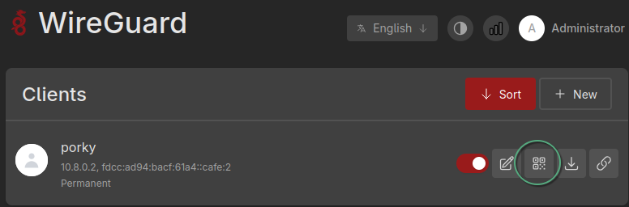

## Paso 9) Levantar servidor con Nginx.

Vamos a levantar los archivos con Nginx. Para esto, necesitamos: 

```bash
mkdir -p services/web_server
```
Creamos la página principal con Flask:

```python
#main.py
from flask import Flask, render_template_string
import os

app = Flask(__name__)
@app.route("/")
def index():
    users = []
    for username in os.listdir("/home"):
        if os.path.isdir(f"/home/{username}/public_html"):
            users.append(username)
    
    html = """
    <!DOCTYPE html>
    <html>
    <head>
      <meta charset="UTF-8">
      <title>Servidor Web - VPN Alpine</title>
      <style>
        body { font-family: sans-serif; background-color:#1e1e1e; color:#f3f3f3; text-align:center; padding:2rem; }
        h1 { color:#00bcd4; }
        ul { list-style:none; padding:0; }
        a { color:#80cbc4; text-decoration:none; font-size:1.2rem; }
        a:hover { text-decoration: underline; }
      </style>
    </head>
    <body>
      <h1>Bienvenido al File Server</h1>
      <p>Usuarios disponibles:</p>
      <ul>
      
        <li><a href="/~{{ user }}/">{{ user }}</a></li>
      
      </ul>
    </body>
    </html>
    """
    return render_template_string(html, users=users)

if __name__ == "__main__":
    app.run(host="0.0.0.0", port=5000)
```

Creamos un Dockerfile para levantar la web de Flask:

```Dockerfile
FROM python:3.12-alpine

WORKDIR /app

COPY main.py .

RUN pip install flask

EXPOSE 5000

CMD ["python", "main.py"]
```

Creamos el contenedor de Nginx con docker-compose.yml:

```yaml
services:
  web:
    image: nginx:stable-alpine
    container_name: nginx-web
    restart: always
    ports:
      - "0.0.0.0:8080:80" 
    volumes:
      - /home:/home:ro
      - ./nginx.conf:/etc/nginx/nginx.conf:ro
  index_flask:
    build: .
    container_name: index_flask
    restart: always
    volumes:
      - /home:/home:ro
```

Creamos la configuración de nginx en nginx.conf:

```conf
events {}
http {
    server {
        listen 80;
        server_name localhost;

        location / {
         proxy_pass http://index_flask:5000/;
        }

        # Sirve el public_html de cada usuario
        location ~ ^/~([^/]+)(/.*)?$ {
            alias /home/$1/public_html$2;
            autoindex on;
            index index.html;
        }

        # Seguridad básica: bloquea acceso fuera de /home/*/public_html
        location ~ ^/~([^/]+)/(\.\.|\.git|\.ssh) {
            deny all;
        }
    }
}
```
Levantamos el servidor con:
```bash
docker compose up -d
```

## Paso 10) Creamos un Nuevo usuario y subimos archivos

Una vez que terminamos de crear el server, debemos crear un nuevo usuario y su public_html.

```bash
sudo adduser tool
sudo mkdir -p /home/tool/public_html
sudo chown -R tool:tool /home/tool/public_html
su - tool
```

Una vez que nos logueamos con el usuario *tool*. Podemos agregar cualquier archivo.

Algunos ejemplos:

```bash
echo "hola" >> hola.txt
```

```bash
scp react\ taz.mp4 porky@192.168.0.228 /home/porky/public_html
```

Si accedemos a: **192.168.0.228:8080** veremos un Index con todos los usuarios posibles

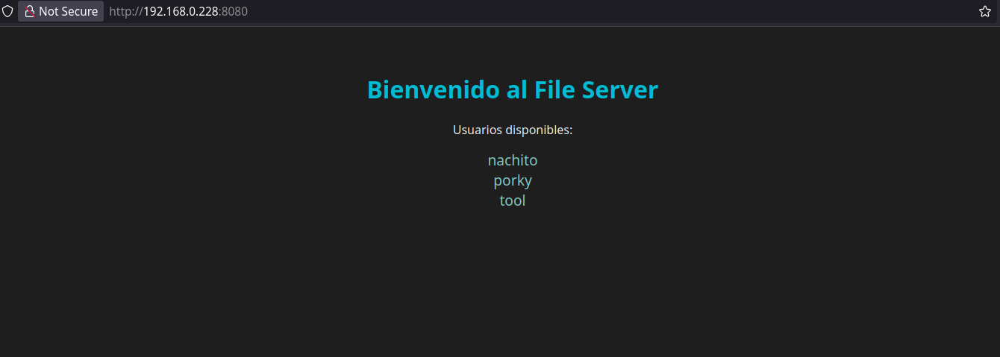

## Paso 11) Configurar autenticación para los usuarios (Opcional)

Si queremos hacer que los usuarios tengan que poner una contraseña para autenticarse al acceder a su public_html,debemos crear un archivo .htpasswd en el mismo directorio public_html

```bash
# Ejecutar con user porky
sudo apk add apache2-utils
htpasswd -c /home/porky/public_html/.htpasswd porky # Nos va a pedir la contraseña para el user porky
```

Cada usuario va a tener que crearse su propia contraseña, puede tambien no poner niguna contraseña y que todos puedan acceder a sus archivos. El comando generico sería:

```bash
# Ejecutar como <user>
htpasswd -c /home/<user>/public_html/.htpasswd <user>
```

El archivo de nginx nos quedaria así:

```conf
events {}
http {
    server {
        listen 80;
        server_name localhost;

        location / {
         proxy_pass http://index_flask:5000/;
        }

        # Sirve el public_html de cada usuario
        location ~ ^/~([^/]+)(/.*)?$ {
            alias /home/$1/public_html$2;
            autoindex on;
            index index.html;

            auth_basic "Logueate para acceder";
            auth_basic_user_file /home/$1/public_html/.htpasswd;
        }

        # Seguridad básica: bloquea acceso fuera de /home/*/public_html
        location ~ ^/~([^/]+)/(\.\.|\.git|\.ssh) {
            deny all;
        }
    }
}
```

Ahora, antes de entrar a cada usuario nos va a pedir el usuario y contraseña:

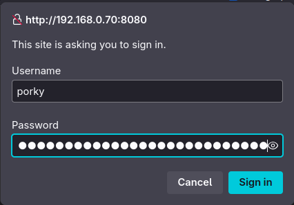

Y si queremos acceder a otro usuario nos va a tirar un error 403 forbidden


Cabe aclarar que este método de autenticación funciona, pero tiene varios problemas con este método para autenticar:

- No podemos desloguearnos, tenemos que reiniciar el browser para que se nos cierre sesión
- No podedmos acceder a multiples usuarios en simultaneo sin desloguearnos
- Todos los usuarios **deben** tener contraseña, porque aunque no tengas contraseña te pide una y no es posible poner un caracter vacio como contraseña.  

## Paso 12) Hacemos un backup con rsync.

Instalamos rsync
```bash
#Con usuario root
su
cd /home
apk add rsync
```

Creamos un script de bash para automatizar esta tarea:

```bash
# Ejecutando con user root
su -
cd /usr/local/bin

vim backup_users.sh

#!/bin/sh
REMOTE_USER="porky"
REMOTE_HOST="192.168.0.15"
REMOTE_PATH="/home/porky/darthpedro/backups/public_html"
LOG_FILE="/var/log/backup_users.log"

echo "Backup iniciado: $(date)" >> "$LOG_FILE"

for USER_DIR in /home/*; do
    [ -d "$USER_DIR" ] || continue

    USERNAME=$(basename "$USER_DIR")
    SRC_PATH="$USER_DIR/public_html"

    if [ -d "$SRC_PATH" ]; then
        echo "-> Haciendo backup de $USERNAME..." | tee -a "$LOG_FILE"

        rsync -az --delete "$SRC_PATH/" \
            "${REMOTE_USER}@${REMOTE_HOST}:${REMOTE_PATH}/${USERNAME}/" \
            >> "$LOG_FILE" 2>&1

        if [ $? -eq 0 ]; then
            echo "Backup de $USERNAME completado." | tee -a "$LOG_FILE"
        else
            echo "Error al respaldar $USERNAME." | tee -a "$LOG_FILE"
        fi
    fi
done

echo "Backup finalizado: $(date)" >> "$LOG_FILE"
```

Hacemos un cron para que se ejecute cada 5 minutos el backup

```bash
*/5 * * * * /usr/local/bin/backup_users.sh >> /home/porky/backup_u
```

SSH key pair

Para que no nos pida la contraseña cada vez que queremos hacer el backup y para que el cron corra automáticamente, haremos la conexión ssh mediante claves públicas y privadas

```bash
#En alpine, como root 
su - 
ssh-keygen -t ed25519 -C "backup_vm_key"
ssh-copy-id porky@192.168.0.15
```

Con esto ya tendriamos la conexión ssh usando una clave
